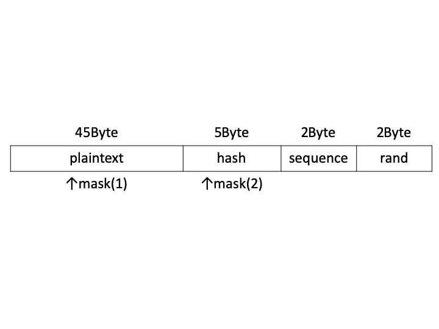

# Cubing暗号の利用モード(編集中)

## 概要

* 平文ブロック長：45byte
* 暗号文ブロック長：54byte
* 鍵長：可変
* 暗号化処理の並列化：可 (※但し，Shuffleがボトルネックとなる)
* 復号処理の並列化：可 (※但し，Sortがボトルネックとなる)
* Random Read：不可

## 図




## 流れ

### 暗号化

1. 平文をブロックに分ける
2. 必要があればパディングを用意する
3. 全ての平文に対してマスク処理を行う
4. 全てのブロックに対し、エンコードを行う
5. 全てのブロックの平文以外の箇所に対してマスク処理を行う
6. ブロックごとに暗号化を行う
7. ブロックをシャッフルする (「[リプレイ攻撃対策](#リプレイ攻撃対策)」参照)

### 復号

1. 暗号文をブロックに分ける
2. 全てのブロックに対して復号を行う
3. 暗号化の(5)で使用したマスク処理を元に戻す
4. (3)により現れるシーケンス番号を元に，ブロック間ソートを行う
5. 暗号化の(3)で使用したマスク処理を元に戻す
6. 全てのブロックに対し、デコードを行う
7. 全てのブロックを結合さ背，平文を生成する

## パディング

平文ブロックが45byteに満たない場合、1Byte分null入れ、残りはランダムな英数列を入れる。

## 62進数の説明

AA, AB, AC, ... , AZ, Aa, Ab, Ac, ... , A0, A1, A2, ... , A9, BA, BB, ... , B9, CA, ... , 99, ...
なお、本暗号利用モードではAA~99までが使用される。

## エンコード

本節では以下の記号を用いる。

$n$：現在操作しているブロックの番号(0,1,2,...)
$C_i$：ブロックの$i$ Byte目の文字
$\mathrm{toas}(C)$：特定の文字$C$のASCIIコードにおける番号
$\mathrm{fras}(N)$：特定の数字$N$のASCIIコードにおける文字
$\mathrm{rand}()$：アルファベット又は数字から１文字を一様に選ぶ関数
$\mathrm{to62}(x)$：0~61までの自然数xを62進数に従って文字に変換する関数

この時、

```math
\begin{aligned}

C_{45+i} &= \mathrm{fras}\left(\left(\left(\sum_{j=9(i-1)+1}^{9i}{\mathrm{toas}(C_j)}\right)\bmod 26\right)+97\right)\\

C_{51} &= \mathrm{to62}\left (\left \lfloor\frac{n}{62}\right \rfloor \right)\\

C_{52} &= \mathrm{to62}\left ( n \bmod 62 \right)\\

C_{53} &= \mathrm{rand}()\\

C_{54} &= \mathrm{rand}()\\

\end{aligned}
```

とする。ただし、$i=1,2,3,4,5$とする。これを全てのブロックに対して行う。

## mask(1)

(編集中)

## mask(2)

(編集中)

## 表示可能文字

(編集中)

## encrypt

(編集中)

## decrypt

(編集中)

## shuffle

(編集中)

## sort

(編集中)

## 送信内容

(編集中)

## リプレイ攻撃対策

暗号化後に全ブロックをシャッフルする。Fisher–Yatesのアルゴリズムを用いることによって高速に実現可能となる。

### ブロックが$62^2$より多くある時の処理

$62^2$個のブロックを１つの大きなブロックとして考え、各大きなブロックをECBモードで暗号化する。
上記「[リプレイ攻撃対策](#リプレイ攻撃対策)」では、$62^2$個の大きなブロックごとにシャッフルする。
